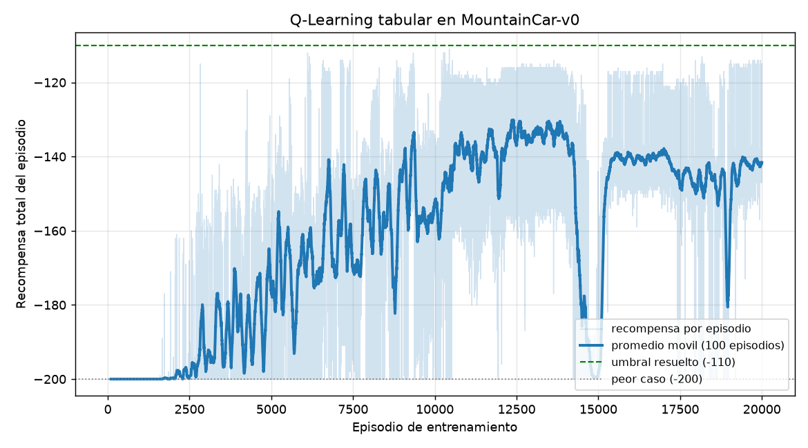
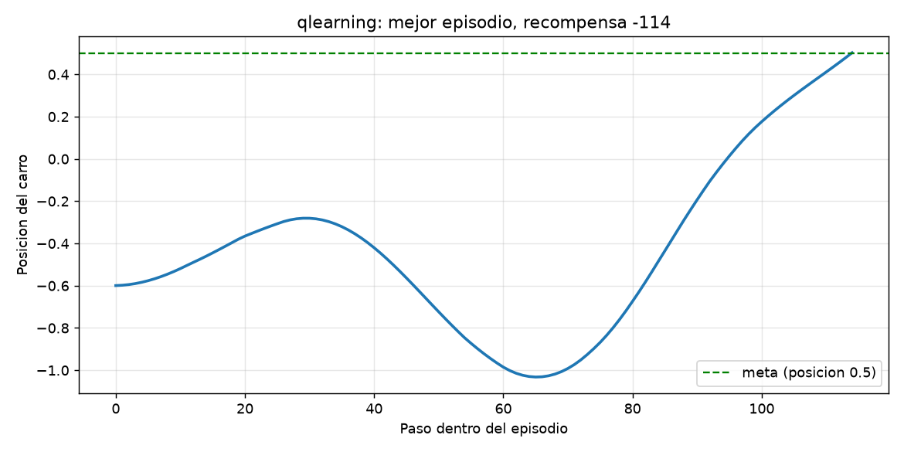
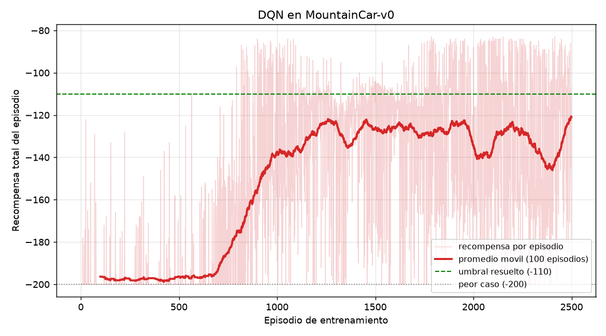
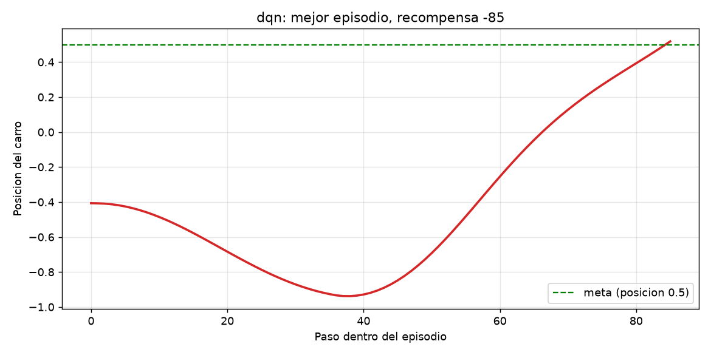
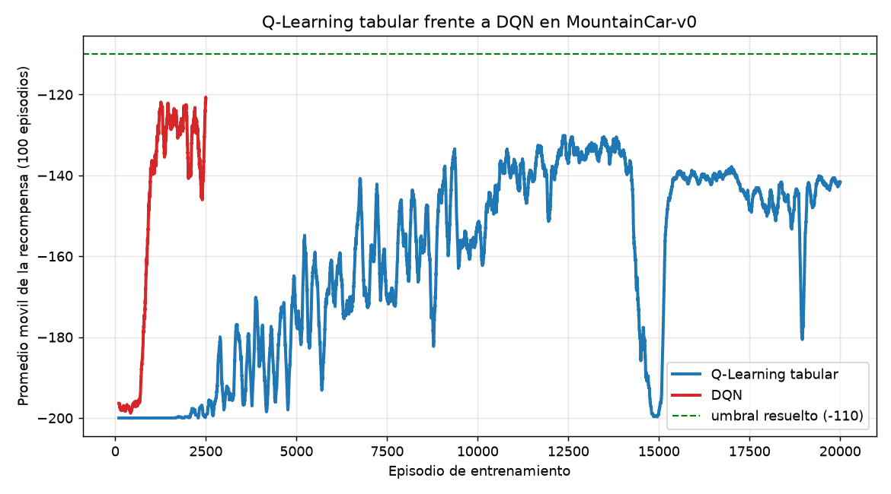
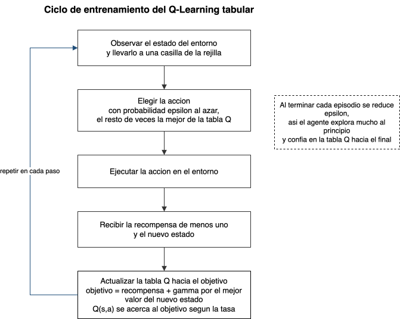
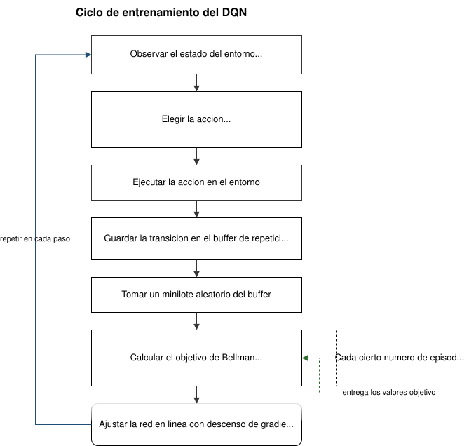

# MountainCar con Q-Learning tabular y DQN

Este repositorio resuelve el entorno MountainCar-v0 de Gymnasium con dos agentes de aprendizaje por refuerzo escritos desde cero. El primero es un Q-Learning tabular que guarda los valores en una tabla. El segundo es un DQN que reemplaza esa tabla por una red neuronal. El objetivo del trabajo es entender en qué se parecen y en qué se diferencian un método clásico y un método basado en aprendizaje profundo, viendo cómo entrena cada uno, qué resultado alcanza y con qué dificultades se topa.

El punto de partida fue el repositorio base del curso, que trae toda la infraestructura lista (el CLI, los bucles de entrenamiento y el guardado de agentes) y deja los algoritmos como espacios por completar. El trabajo consistió en completar esos algoritmos y en documentar el proceso.

## El entorno MountainCar-v0

Un carro con motor débil está en el fondo de un valle. El motor no tiene fuerza para subir de frente la colina de la derecha, así que la única forma de salir es mecerse hacia adelante y hacia atrás para ganar impulso, parecido a un niño en un columpio. La meta es llegar a la bandera, que está en la posición 0.5.

El estado tiene dos números continuos, la posición y la velocidad del carro. Las acciones son tres, empujar a la izquierda, no empujar y empujar a la derecha. La recompensa es de menos uno en cada paso y nada más, y el episodio se corta a los 200 pasos. Esto significa que la recompensa total de un episodio es simplemente el negativo de cuántos pasos tardó, por lo que un número menos negativo es mejor. Un agente que nunca llega a la bandera se queda en menos 200, y se considera que el problema está resuelto alrededor de menos 110.

Esa recompensa plana es lo que hace interesante al problema. Como todos los pasos valen lo mismo, no hay ninguna pista que guíe al agente hacia la meta. El agente tiene que tropezar con la bandera por exploración antes de poder aprender algo.

## Instalación

El proyecto usa uv para las dependencias.

```bash
uv sync
```

Con eso queda todo listo, incluyendo Gymnasium, NumPy y PyTorch.

## Cómo ejecutar

Todo se maneja con el comando `mountaincar`.

```bash
uv run mountaincar inspect            # ver el entorno antes de empezar
uv run mountaincar train qlearning    # entrenar el agente tabular
uv run mountaincar load qlearning --eval   # evaluar el agente guardado
uv run mountaincar render qlearning   # ver el carro conducir en una ventana
```

El mismo patrón sirve para el DQN cambiando `qlearning` por `dqn`. El repositorio ya trae los dos agentes entrenados en la carpeta `saves`, así que se puede evaluar sin volver a entrenar.

## El agente de Q-Learning tabular

El estado tiene dos números continuos y una tabla necesita casillas discretas, así que se parte cada dimensión en 20 tramos y cada celda de la rejilla resultante se trata como un estado. Con eso hay 400 celdas posibles. En cada paso el agente mira en qué celda está, elige una acción, recibe la recompensa y el nuevo estado, y ajusta el valor de esa celda hacia el objetivo temporal, que es la recompensa más el mejor valor esperado del estado siguiente. La acción se escoge con la regla epsilon greedy, que al principio explora casi siempre al azar y con el paso de los episodios confía cada vez más en la tabla.

Los hiperparámetros usados son los del repositorio base. La tasa de aprendizaje es 0.1, el factor de descuento es 0.99, y epsilon baja desde 1.0 hasta 0.01 multiplicándose por 0.9995 en cada episodio. El entrenamiento fue de 20000 episodios y tarda alrededor de un minuto y medio.

Al evaluar el agente en 100 episodios en modo codicioso, la recompensa media fue de menos 138.66, el mejor episodio llegó a menos 114, y el carro alcanzó la bandera en los 100 episodios. La curva de entrenamiento muestra que el desempeño se queda en menos 200 durante un buen rato y luego empieza a subir, con bastante oscilación incluso al final.



Como evidencia adicional, esta es la posición del carro paso a paso en su mejor episodio. Se ve el vaivén que primero retrocede para tomar impulso y después sube hasta cruzar la línea de la meta.



## El agente DQN

El DQN usa el mismo algoritmo de fondo, pero la tabla se reemplaza por una red neuronal pequeña que recibe los dos números del estado sin discretizar y devuelve un valor por cada acción. La red tiene dos capas ocultas de 128 unidades con activación ReLU. El entrenamiento suma dos piezas nuevas. La primera es un buffer de repetición, donde se guardan las transiciones vividas para volver a aprender de ellas en lotes aleatorios. La segunda es una red objetivo, que es una copia congelada de la red principal y que se usa para calcular el objetivo de Bellman, de modo que ese objetivo no se mueva mientras la red principal aprende. La red objetivo se sincroniza con la principal cada diez episodios.

### El problema de la exploración y cómo se resolvió

Con la red y el aprendizaje ya correctos, el DQN corría sin errores pero reportaba un desempeño completamente plano, sin aprender nada. Antes de tocar el código, la primera comprobación fue probar el mismo agente en CartPole, un entorno más sencillo, donde sí aprendió y pasó de 25 a más de 200 de recompensa. Eso confirmó que el código de aprendizaje estaba bien y que el problema era propio de MountainCar.

La causa está en la exploración. La versión de libro escoge una acción al azar en cada paso de forma independiente. Como el carro necesita una tanda larga de empujones en la misma dirección para ganar impulso, y sacar la misma acción unas veinte veces seguidas al azar es casi imposible, el agente nunca llega a la bandera ni una sola vez. Al no ver nunca la meta, la red aprende algo que, con los datos que recibió, es correcto, que ninguna acción cambia el resultado. El fallo no está en cómo aprende sino en los datos que recoge.

La solución fue cambiar solo la exploración, sin tocar el aprendizaje ni el entorno. En lugar de sacar una acción nueva en cada paso, cuando el agente decide explorar se queda con la misma acción durante varios pasos seguidos. Así las acciones de exploración quedan correlacionadas en el tiempo y producen el vaivén sostenido que el carro necesita. En modo de evaluación la exploración se apaga por completo y el agente juega siempre de forma codiciosa.

Los hiperparámetros son los del repositorio base, con la tasa de aprendizaje en 0.001, el factor de descuento en 0.99, lotes de 64 transiciones y epsilon que baja de 1.0 a 0.01 multiplicándose por 0.995. El único parámetro nuevo controla cuántos pasos dura como máximo una tanda de exploración, fijado en 20. El entrenamiento fue de 2500 episodios.

Al evaluar en 100 episodios en modo codicioso, la recompensa media fue de menos 117.33, el mejor episodio llegó a menos 85, y el carro alcanzó la bandera en los 100 episodios. La curva muestra el patrón que anticipaba el problema de exploración. Durante los primeros 650 episodios el desempeño es plano, mientras el buffer se llena de trayectorias y epsilon todavía es alto. Después sube rápido y se estabiliza. Vale la pena notar que el promedio durante el entrenamiento se ve peor que la evaluación, porque durante el entrenamiento la exploración sigue metiendo tandas al azar que arruinan algunos episodios.



Esta es la trayectoria del carro en el mejor episodio del DQN. El impulso hacia la izquierda es más marcado y llega a la meta en menos pasos que el agente tabular.



## Comparación entre los dos métodos

La siguiente gráfica pone los dos promedios móviles en el mismo eje. Salta a la vista que el DQN aprende mucho antes, en cerca de mil episodios, mientras que el tabular necesita del orden de veinte mil.



El resumen numérico de las dos evaluaciones es el siguiente.

| Método | Recompensa media (100 episodios) | Mejor episodio | Llega a la meta | Episodios de entrenamiento |
|---|---|---|---|---|
| Q-Learning tabular | -138.66 | -114 | 100 de 100 | 20000 |
| DQN | -117.33 | -85 | 100 de 100 | 2500 |

En cuanto a la velocidad de aprendizaje, el DQN gana con claridad, porque la red comparte lo aprendido entre estados parecidos y no tiene que visitar cada celda por separado como sí ocurre en la tabla. En cuanto a la estabilidad, la curva del DQN es más limpia una vez que arranca, mientras que la del tabular oscila mucho y hasta tiene caídas fuertes en tramos avanzados, algo típico de la tabla cuando el uno por ciento de exploración perturba celdas ya aprendidas. En cuanto al desempeño final, el DQN queda mejor, con menos 117 frente a menos 138, y además cruza el umbral de resuelto que está en menos 110 en sus mejores episodios.

Las ventajas del método tabular son su sencillez y su transparencia, porque cada valor se puede leer directamente y no hace falta ninguna librería de aprendizaje profundo. Su principal limitación es que solo funciona bien cuando el estado se puede partir en pocas casillas, y aun así aprende despacio y de forma ruidosa. El DQN escala mejor a estados continuos y aprende más rápido, pero su limitación es que exige más piezas móviles, el buffer, la red objetivo y sobre todo una exploración adecuada, y es justo esa exploración la parte más delicada de todo el trabajo.

Sobre la dificultad de implementación, el tabular fue directo, ya que las tres partes por completar eran cortas y su comportamiento se entiende de inmediato. El DQN fue más exigente. La red y el paso de aprendizaje tienen el riesgo silencioso de mezclar las formas de los tensores, y el verdadero reto fue diagnosticar por qué no aprendía, que no era un error de código sino una limitación de la estrategia de exploración frente a la recompensa plana del entorno.

## Esquemas del proceso de entrenamiento

Este es el ciclo del Q-Learning tabular. En cada paso el agente observa el estado y lo lleva a una casilla, elige la acción, la ejecuta, recibe la recompensa y el nuevo estado, y actualiza la tabla hacia el objetivo temporal.



Este es el ciclo del DQN. Se añaden el buffer de repetición, del que se toma un lote aleatorio, y la red objetivo, que entrega los valores para el objetivo de Bellman con el que se ajusta la red principal.



Los archivos editables de estos dos esquemas están en `docs/qlearning_ciclo.drawio` y `docs/dqn_ciclo.drawio`, y se abren en draw.io.

## Cómo reproducir los resultados

Los agentes entrenados y las curvas ya vienen en la carpeta `saves`, pero todo se puede regenerar. Para el agente tabular se usó la semilla 7.

```bash
uv run python scripts/run_experiment.py qlearning --episodes 20000 --seed 7
```

Para el DQN, el entrenamiento se hizo por tramos con la semilla 0, guardando el buffer entre tramos para no perder las trayectorias exitosas ya vistas.

```bash
uv run python scripts/train_dqn_resumable.py --total 2500 --run 2500 --chunk 150 --seed 0
```

Las figuras se generan a partir de las curvas guardadas.

```bash
uv run --with matplotlib python scripts/make_figures.py
uv run --with matplotlib python scripts/make_trajectory_figures.py
```

## Estructura del proyecto

El código de los agentes está en `src/mountain_car/agents`, con `qlearning.py` para el agente tabular y `dqn.py` para el DQN. El CLI está en `src/mountain_car/cli.py`. Los scripts de entrenamiento y de figuras están en `scripts`. La evidencia, las curvas y los esquemas están en `docs`. Los agentes entrenados y sus resúmenes de evaluación están en `saves`.
